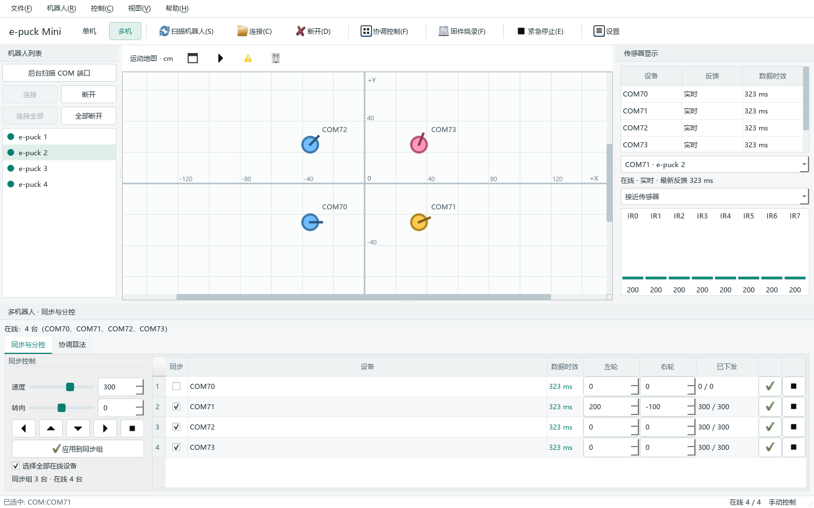
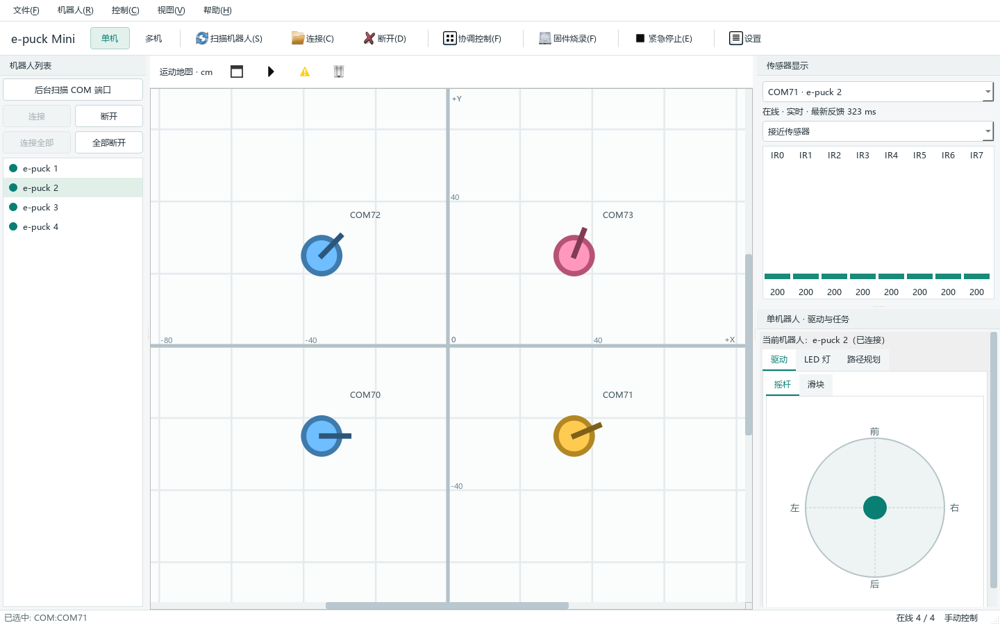

# 通信、流畅度与验收

适用 0.5.0。默认后端为经典蓝牙 SPP 虚拟 COM，不是已接通的 BLE GATT。

## 线程与时序

```text
后台线程池：端口枚举、2..4 个并发识别任务
主线程：状态、选中对象、可见 UI、20 Hz 轻量协调算法
每设备线程：QSerialPort、遥测/图像事务、命令定时器、看门狗
规划线程/进程：内置 A*，或异步 Python/MATLAB
```

选中对象只决定详细显示和单机手动控制，不决定哪些串口在线。同步勾选只决定群体命令成员，未勾选设备仍接收遥测。

轮速批次共享序号和 steady_clock 截止时间，默认提前 12 ms；端口线程使用精确定时器。更新待发命令时保留较早截止时间，避免持续输入导致不断推迟。零速立即排队并替换待发运动，旧序号不能覆盖新命令。

这是主机批量调度，不能保证电机同时执行。精确同步还需机器人时钟校准、固件执行时间戳、命令序号确认、实际轮速与丢包统计。

## 官方 BTcom 命令

二进制字节是对应字符的负值，各组以 0x00 结束。传感器回复没有 ASCII 行分隔，内部 0x0A/0x0D 是普通数据。

| 查询/命令 | 字符 | 字节 | 回复长度 |
| --- | --- | --- | --- |
| 接近 | N | B2 | 16 字节 |
| 加速度球坐标 | A | BF | 12 字节，三个 float |
| 原始加速度 | a | 9F | 6 字节 |
| 编码器 | Q | AF | 4 字节 |
| 麦克风 | u | 8B | 6 字节 |
| 图像 | I | B7 | 3 字节帧头 + 像素 |
| 电机设置 | D | BC | 无数据回复 |
| LED 设置 | L | B4 | 无数据回复 |

遥测发送 B2 BF 9F AF 8B 00，完整接收 44 字节按请求顺序解析。基础兼容发送 B2 BF 00，接收 28 字节。Selector 使用 C\r ASCII 握手并记录一次。

图像初始化 J,0,40,40,8\r，仅查看摄像头时请求，最多等 2 秒。该端口完成一帧前不发下一次遥测查询，电机仍可排队发送。未知帧头或超时进入迟到字节隔离及重新同步，不把半帧当有效数据。

## 信号真实性

- validFields 表示字段曾收到有效值，fieldTimestamps 为最后有效更新时间。
- 零值也是有效数据，部分更新不覆盖其他字段。
- 过期、离线和未接入须与最后数值一起解释，不能只看柱状图。
- 接近显示归零/平滑后的 ADC 响应，不是标定距离；原始加速度是 ADC。
- 标准电池百分比不能伪造电池电压。
- 编码器驱动相对里程计，初始位姿、轮径/轮距和轮滑决定精度。
- 看门狗在上位机端；PC 断电或蓝牙物理断开后无法保证停止送达，固件也应具备自己的超时停机。

## 自动化验证

测试覆盖构造协议帧、零值合并、截断通知、非方形图像旋转、编码器回绕、命令合并/停止优先、四设备同步与分控、移除设备、1024×720/1440×900 两种布局、异步规划、八设备遥测突发和日志滚动。

不使用真实 COM，不能宣称实测蓝牙时延或硬件同步。八机突发检验 1200 次部分状态更新期间事件循环可处理事件，不代表实机持续采样率。

0.5.0 本机最终回归：Debug 40/40、Release CTest 40/40 通过。以下截图使用四台模拟设备的状态，不是实机在线证明。





## 实机验收

1. 正确端口握手成功，空端口超时不假在线；关闭和取消不闪退。
2. 接近/麦克风从非零归零后 UI 更新，字段时间持续更新。
3. 切换摄像头设备不残留上一台图；退出摄像头后遥测恢复，其他设备不受影响。
4. 两机以上连接全部，选择不同对象在线数不变，各数据独立更新。
5. 低速应用同步正负输入，未勾选设备不动；逐台停止只停止对应行。
6. 松开方向/摇杆、切模式、失焦、全局急停，检查实际停止而非仅看命令列。
7. 停止编码器输出，自动算法约 1 秒后暂停；参与设备断线则协调停止。
8. 测量低速直行和旋转，标定轮径/轮距/步数，检查路径累计漂移。
9. 逐步增加设备数，至少运行 30 分钟，记录 UI 延迟、超时、实际轮速与日志增长。
10. 用固件回执或外部定位记录执行时差，不能用主机排队时间替代。

先抬起轮子或在隔离场地低速验证，再运行路径/编队。虚拟障碍不是实时物理障碍检测，目前没有已认证的统一碰撞安全层。
